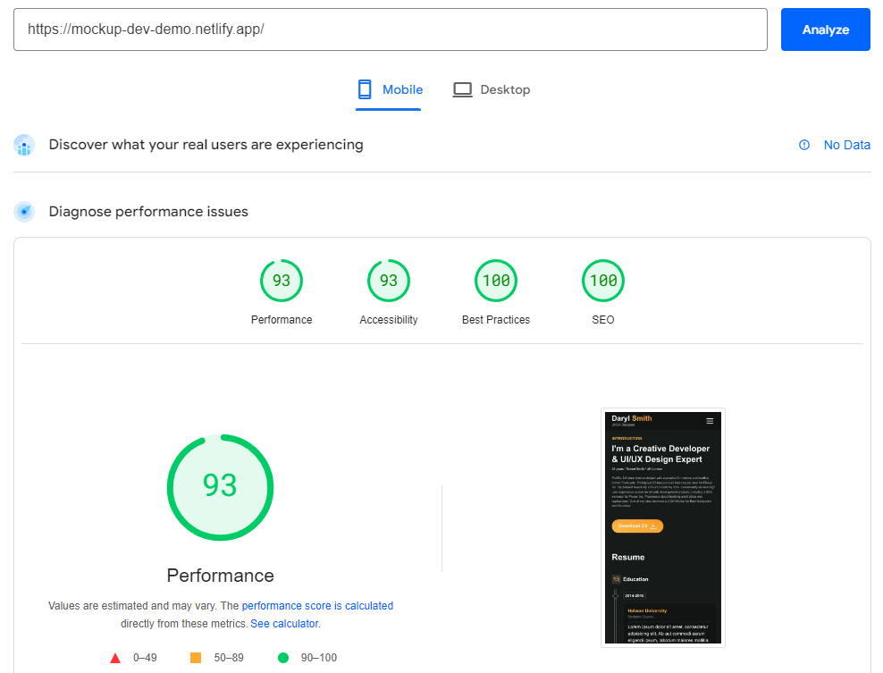

## Quick Start

Install dev dependencies

```sh
pnpm install // or npm install
```

Start development server with live preview

```sh
pnpm dev // or npm run dev
```

Generate build files for production server

```sh
pnpm build // or npm run build
```

# Responsive Design Tools

- Responsive Font sizes: https://utopia.fyi/type/calculator

All dev files are present in `src` folder. The build version can be found in `build` folder after running `yarn build` command.

## PageSpeed Result


